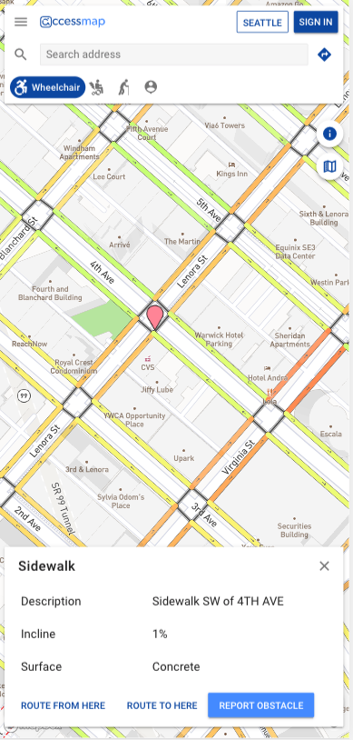
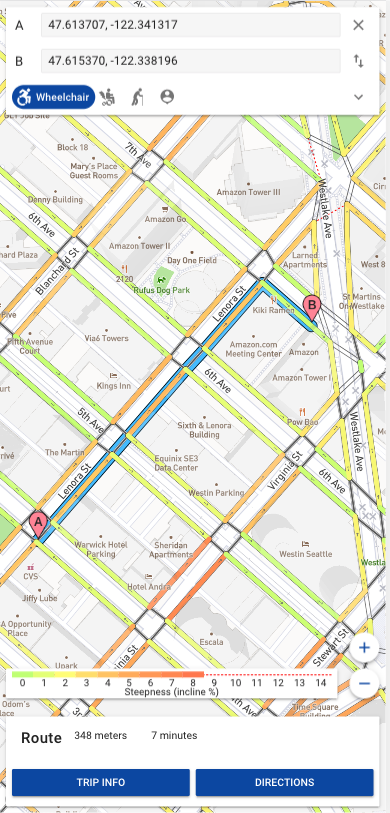
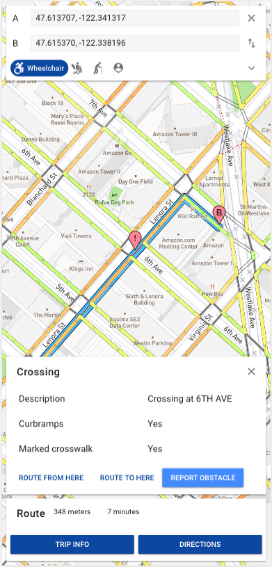
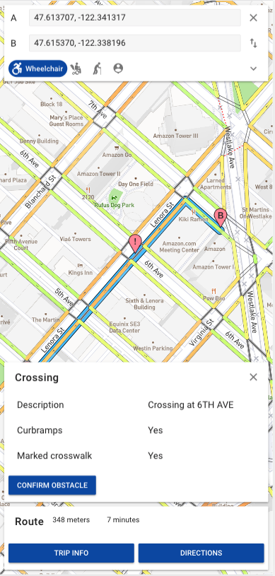
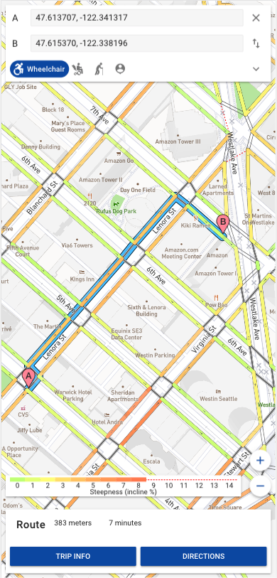

# MACK

An AccessMaps feature that provides a rerouting service around obstacles that users may face in their commute.

## Getting Started

These instructions will get you a copy of the project running on your local machine for development and testing.

## Installing

First, clone the repository to your local machine, using:

`git clone https://github.com/cse482spring2019/MACK.git`

on the command line, or by downloading the .ZIP folder with the github webpage.

Next, set your environment variables in the `.env` file in `/AccessMaps/accessmap` to be hosted at localhost, as such:

`HOST=localhost`, and also entering your `OSM_CLIENT_ID=...`, `OSM_CLIENT_SECRET=...`, as well as your `MAPBOX_TOKEN=...`.

Then, set the environment variables found in the `.env` file in `AccessMaps/webapps` with:

```
  API_SERVER=http://localhost:2015/api/v1
  ROUTING_SERVER=http://localhost:2015/api/v1/routing
  TILE_SERVER=http://localhost:2015/tiles
```

So that we are able to get the api server for users, routing server for generating routes, and the tiles server for using OpenStreetMaps data to build our map.

After that, make the `deploy_dev.sh` script executable with: `chmod u+x deploy_dev.sh`,

and then use
`./deploy_dev.sh` to run the script that will build the docker containers. Using the `deploy_dev.sh` script will eliminate the need to remember the `docker-compose` build instructions.

NOTE: this script will take a while to complete.

After running `./deploy_dev.sh`, the webapp and servers will be running as a docker container at `localhost:2015`.

## Development

In the `/webapps/` directory on a version of npm 6.1.0+, and node 10.7.0+,

Run `docker-compose up` in `AccessMaps/accessmap` to start the docker aggregation of container outputs.

While running `docker-compose up`, run `npm start` or `yarn start` in a new tab in the `AccessMaps/webapps` directory to deploy the web app.

We're currently using yarn for our package manager, so if an error relating to `webpack-cli` appears, run `yarn add -D webpack-cli` in the `/webapp/` directory.

## Usage

Usage of our rerouting feature consists of using the routing feature on AccessMap, and then selecting a point on or near your route where an obstruction has appeared.
<p align="center">
  
</p>

After selecting an origin and destination, any tap or click onto the map will result in a waypoint marker with an exclaimation mark. This marker represents the location of the obstacle.

<p align="center">

</p>

Press 'Report Obstacle' and confirm the location of the selected obstacle with the description of the feature in the card. After confirming, a new route will be given calculated around the blacklisted location.

<p align="center">
 
</p>

Note: at times, rerouting fails to provide a new route around the obstacle. Selecting features around that obstacle (close streets, close crosswalks) will provide additional attempts at getting a new route.

## About

Built on top of https://www.accessmap.io/, we aim to provide a rerouting feature that will assist users with navigating around obstacles they face in the Seattle area.
