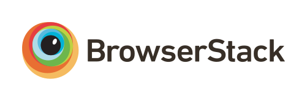

# accessmap-webapp

## Installation

Make sure your `.env` has been set properly in MACK/accessmap-webapp
`HOST=localhost:3000
DEV_OSM_CLIENT_ID=hCY572WCfysbu7bD19QidqR6Y4SjrR2rlk1TR9e4
DEV_OSM_CLIENT_SECRET=OQV2i2jCOCsIFq8agWIIIifJCjyac52mImJJvHsx
MAPBOX_TOKEN=pk.eyJ1Ijoia2VuZG9uZyIsImEiOiJjanZmcXMyc2EyeDU3NDRtZTFqYWpra3IwIn0.ncnJGf_a4F1VbtJUVzlmew

ANALYTICS=no`

Do the docker-compose in the Orchestration directory, then:

run `npm install` in the accessmap-webapp directory

run `npm run build` in the same directory

run `npm start` in the same directory

in the case of package dependencies, use `npm audit fix` to install the packages needed

if you get the error with 'webpack-cli required', do
`npm i -g webpack-cli` or `yarn add webpack-cli -D`

## Configuration

Set the environment variables found in `set_envs.sample`.

#### Important: if running the development server, prefix all `SERVER`

variables with http://. The proxy won't work otherwise and all the servers will
break

## Sponsors / Supporters of Open Source

Continued development of AccessMap is sponsored by the Taskar Center for Accessible
Technology.

Hosting of AccessMap is sponsored by Microsoft Azure.

Cross-browser testing is supported by
 (BrowserStack).
